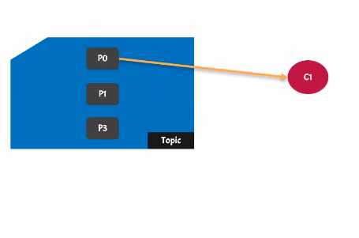
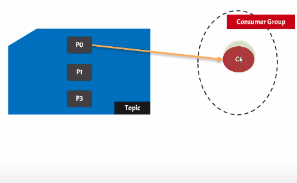
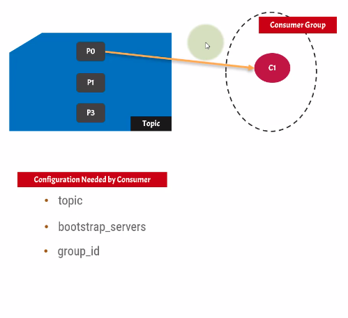

- consumer are the kafka components that consume messages from kafka topic
- internally consumer consume messages from kafka topic partition
- 
- Every consumer is always assigned to a consumer group
  - 
- if no group_id is provided then random group id is assigned
- configuration needed by consumer
  - 